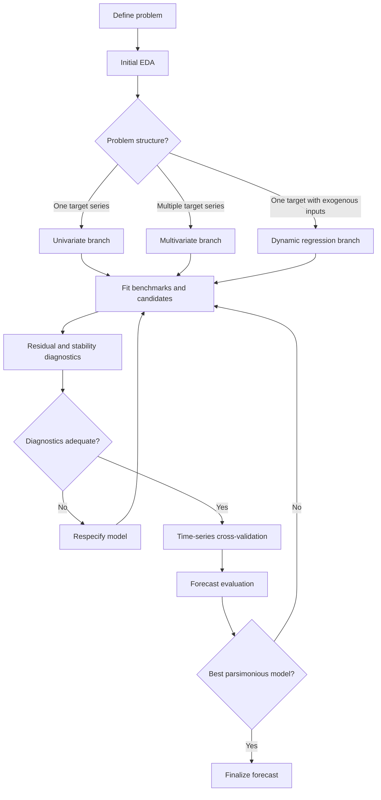
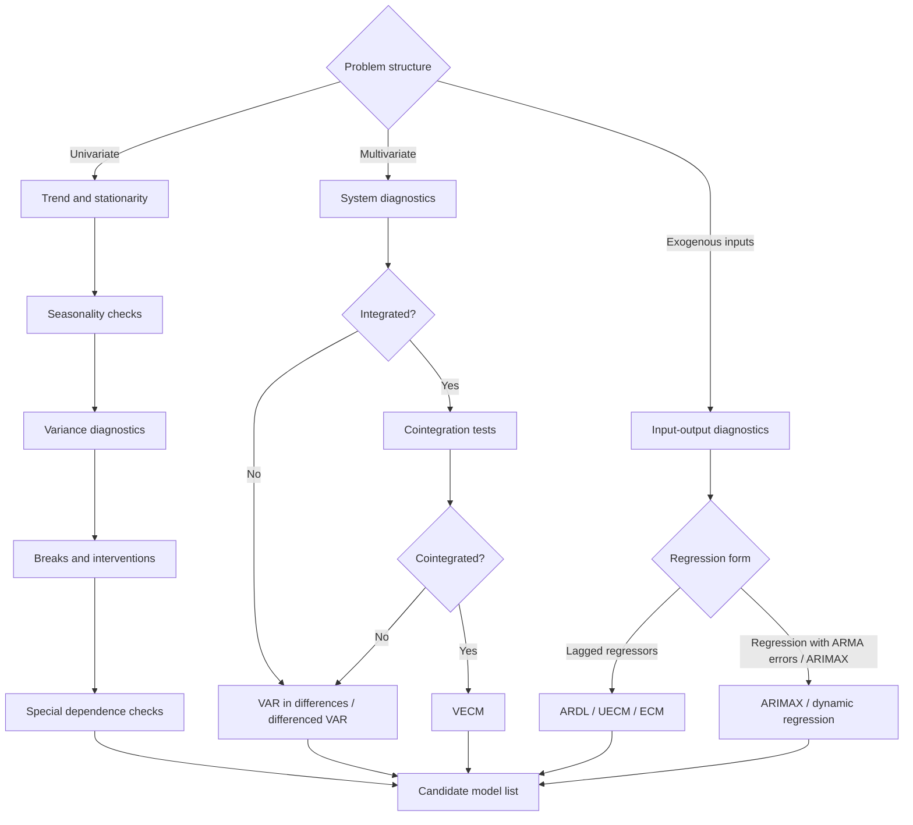

# Time Series Forecasting Workflow

## Core Workflow

## Diagnostics & Model Selection

## Model family selection

| Condition              | Candidate models                                     |
| ---------------------- | ---------------------------------------------------- |
| Stationary linear      | AR / MA / ARMA                                       |
| Trend / nonstationary  | ARIMA                                                |
| Seasonal               | SARIMA / ETS                                         |
| Exogenous inputs       | ARDL / ARIMAX                                        |
| Multivariate           | VAR / VECM                                           |
| Changing variance      | ARCH / GARCH / stochastic volatility                 |
| Long memory            | ARFIMA / FIGARCH                                     |
| Nonlinear / regime     | TAR / SETAR / STAR / Markov switching                |
| Latent components      | State-space / structural time series / Kalman filter |

## Contact

[Murat Koptur](https://www.linkedin.com/in/muratkoptur/)
