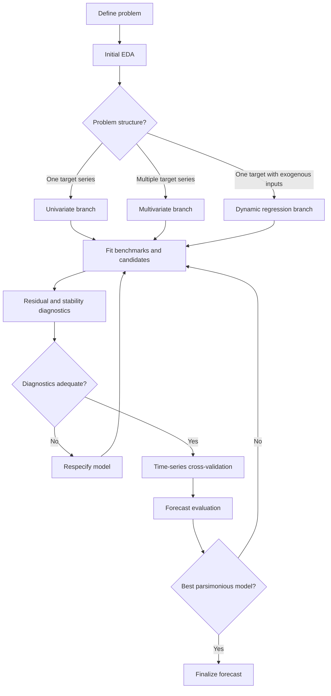

# Core workflow

## Diagram

## Notes

* **Intermittent demand / many zeros**: This branch is for problems where the target series has a large number of zero values, which can pose challenges for traditional forecasting methods. Specialized techniques, such as Croston's method or intermittent demand forecasting models, may be more appropriate in this case.

* **Forecast combination / reconciliation**: This branch is for problems where multiple forecasting models are combined to produce a final forecast. This can be useful when different models capture different aspects of the data, or when there is uncertainty about which model is best. Forecast reconciliation involves ensuring that forecasts from different models are consistent with each other, especially when dealing with hierarchical or grouped time series data.
