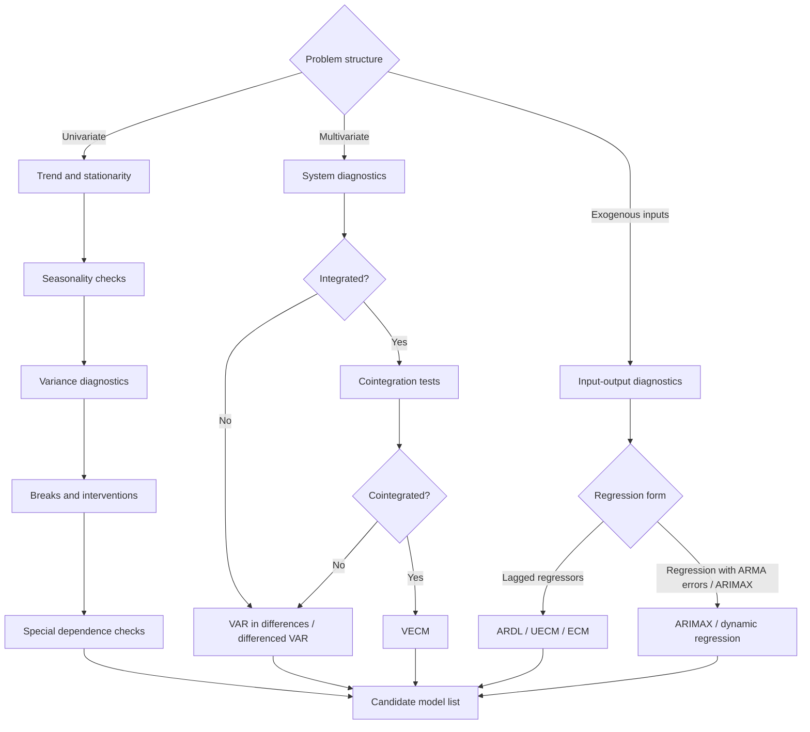

# Diagnostics & Model Selection

## Diagram

## Notes

* Trend and stationarity: ADF, PP, KPSS, break-point unit-root tests

* Seasonality: seasonal dummies, seasonal plots, seasonal unit-root tests

* Variance: log/Box-Cox, ARCH-LM, squared residual checks

* Breaks and interventions: Chow, Zivot-Andrews, Bai-Perron, intervention dummies

* Special dependence: long memory, threshold effects, regime changes, nonlinear dynamics

* Input-output diagnostics: lag inspection, prewhitened Cross-Correlation Function (CCF), intervention and transfer effects
